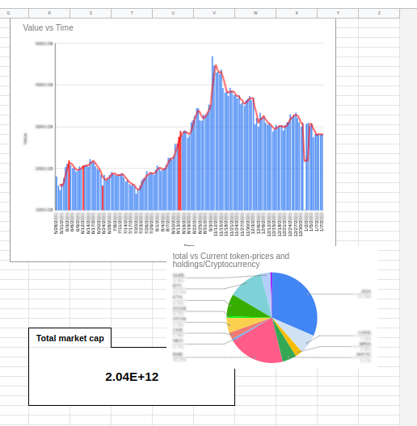

# Crypto-Asset-Calculator

Automated crypto asset calculator using Google Sheets combined with Google Apps Script.

## Install guide

### Easy install
upload the attached spread sheet to your google-drive, open it and click on `Extensions>Apps-Script`.

Create a file for each file in this repository and copy the contents.
 
Generate and add your own API-Keys and Secret-Keys as described in each file.

**Note:** All required API-Keys are read-only, since this tool serves as a portfolio manager that summarizes holdings and values, and it does not perform any trading actions on any platform.

Set a slow (daily/bi-daily/weekly) trigger that periodically runs the main function `myFunction`, to keep a summary of the current assets.

Set an hourly trigger to run `onclickUpdatePrice` function to update prices.

### Manual install (advanced)
Open [Google Sheets](sheets.google.com) and create a new file.

Starting from the fourth line, add one line line per coin writing the symbol of the coin in the first column of the line (BTC, ETH, ADA, SOL, ..).

To add BSC-Tokens (Binance smart contract): Starting from line 35, add one line per token writing the name of the token in the first column and its contract number in the second number.

Your sheet should look like the following in the beginning:

In the sum column (Column `I`) sums over all previous columns starting from the third one (Column `C`).

Total column (Column `J`) multiplies value of sum (Column `I`) by the price (Column `B`).

Row 30 contains the sums. In column `J` it only sums up over the totals of each coin.

**Optionally**, you can add in this row for each exchange the `sumproduct` of holdings in this exchange times the prices which yields an estimate value of the investment in this exchange.

Sum up the totals to compute total value of the coin holdings.

Click on `Extensions>Apps-Script`.

Create a files for each file in this repository and copy the contents.
 
Generate and add your own API-Keys and Secret-Keys as described in each file.

**Note:** All required API-Keys are read-only, since this tool serves as a portfolio manager that summarizes holdings and values, and it does not perform any trading actions on any platform.

Set a slow (daily/bi-daily/weekly) trigger that periodically runs the main function `myFunction`, to keep a summary of the current assets.

Set an hourly trigger to run `onclickUpdatePrice` function to update prices.

**Optionally** add a button to update prices:
`Insert>Drawing` and draw a shape of a button. Right click on the button and click on the three dots in the corner of the drawing. 
Choose `Assign a script` and write `onclickUpdatePrice` in the prompt box.

Historical data of total values will be kept in columns `N, O, P` as DATE,TIME,Value accordingly. You can use them to draw illustrating charts in the main table.

Add two more tables: history-value and history-spot to keep historical data. Write the symbols of the coins in the first row of each. First column is reserved for ID and the second for date and time. Start from the Column `C`.
